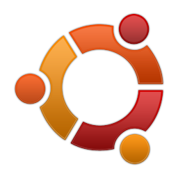
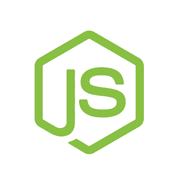
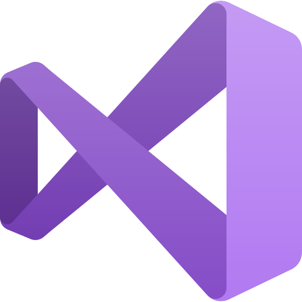

# Andre Madsen
 
## About Me

I've been fiddling with programming for a long time now as a hobby, and I've recently decided to jump head-first into coding.

I've been working with a couple of designers (<a href = "https://www.zencapybara.com">the ZenCapybara team</a>) in a small <a href="https://github.com/ZenCapybara/MidasBankClerk">game project</a> using Unity and C#. The project is still ongoing, and might be ready for beta testing early this year. 

Meanwhile I've been studying like there's no tomorrow. An update on how that's going:

### Progress in C# 

:heavy_check_mark: Refactoring and Clean Code techniques in C# (thanks uncle Bob!!!)  
:heavy_check_mark: Unit testing on C# using  xUnit  
:heavy_check_mark: Programming in .Net with Visual Studio  
:heavy_check_mark: Unity Engine projects in C#  
:heavy_check_mark: Basic C# and object orientation  

### Progress in Javascript/NodeJS
:heavy_check_mark: Using ReactJS to Build Dynamic Components  
:heavy_check_mark: Unit Testing with Mocha  
:heavy_check_mark: Typescript  
:heavy_check_mark: Programming with NodeJS for BackEnd  
:heavy_check_mark: Javascript and Javascript Object Orientation  

### Progress in HTML/CSS
:heavy_check_mark: HTML5  
:heavy_check_mark: CSS3  
:heavy_check_mark: BootStrap  

### Progress on Other Topics
:heavy_check_mark: Agile Methods: Scrum and Kanban  
:heavy_check_mark: Git: Creating , Pulling and Pushing Projects on GitHub  

<!---## 
#### 

Tópicos:
Arquiteturas:
- Solid
- AspNet Core (MVC)
- Rest + Restful
- GitFlow (Branch Structure)
- Mensageria

- Docker
- kubernetes
- Razor
- SQL Server

--->  
### Skills in Programming
<table>
  <tr>
    <th>Operating System</th>
    <th>Languages | Software | Libraries</th>
    <th>Tools</th>
  </tr>
  <tbody>
    <tr>
      <td>
        
        
        
        
      </td>
      <td>
        
        
        
        
        
      </td>
      <td>
        
        
        
      </td>
    </tr>
  </tbody>
</table>

## Contact Me
          

